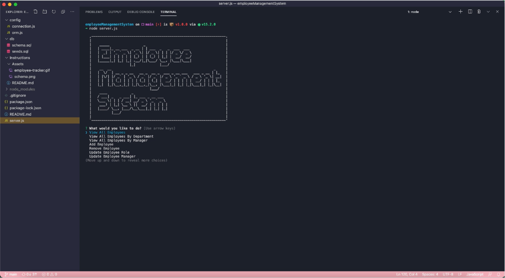
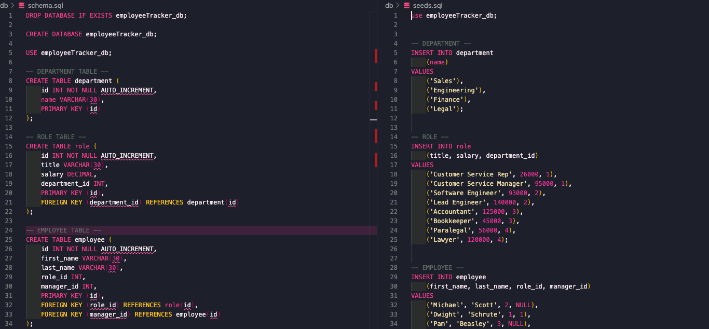
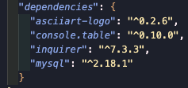
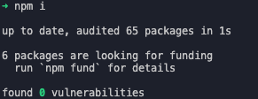
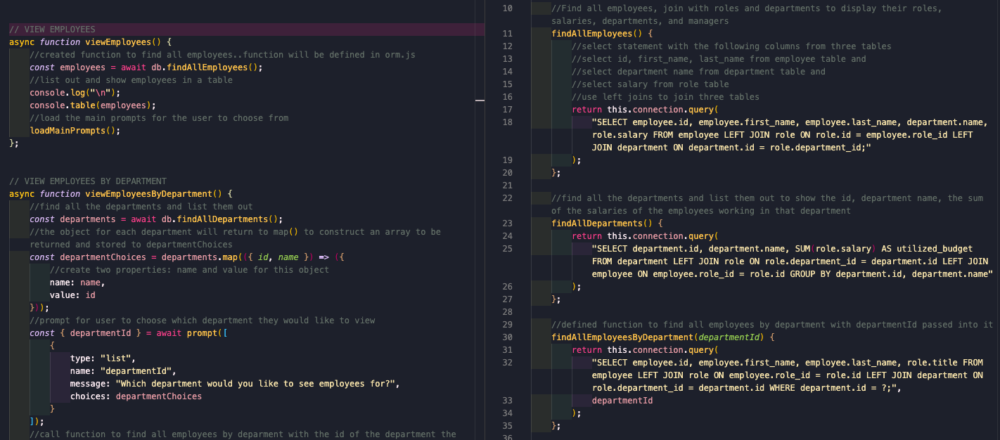

# employeeManagementSystem

This interface allows business owners to view and manage their departments, roles, and employees in their company so they can better organize and plan their business.

1. The db file was created with the schema and seeds sql files to create a database with appropriate tables and columns and data to prepopulate the tables.

    

2. All the required packages were installed and the application was connected to mysql using the conenction.js file.

     

3. server.js file and orm.js files were created to work with simultaneously.

4. Created initial function and prompts to start the program.

5. Went through each option given to the user and created a function with select statements to allow the user to perform the task they requested. 

    

